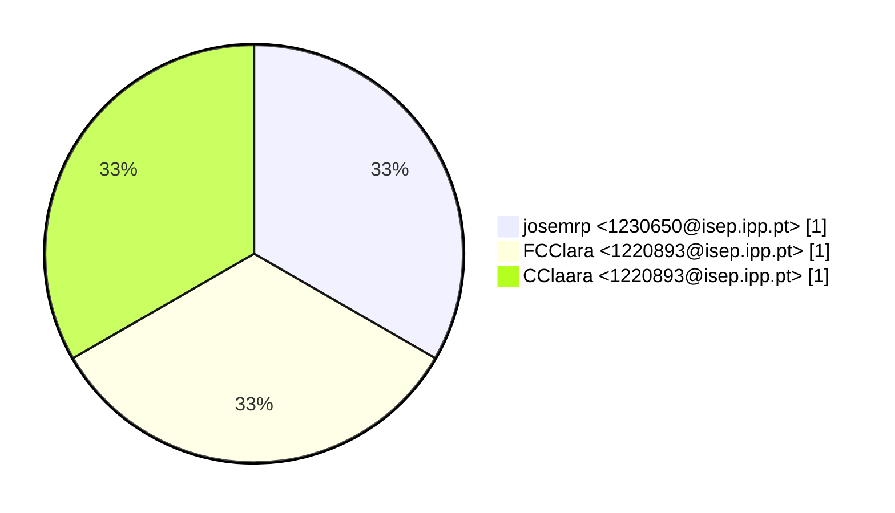
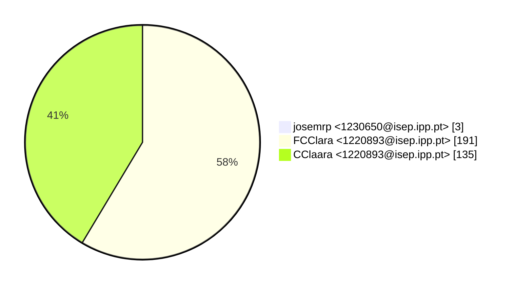
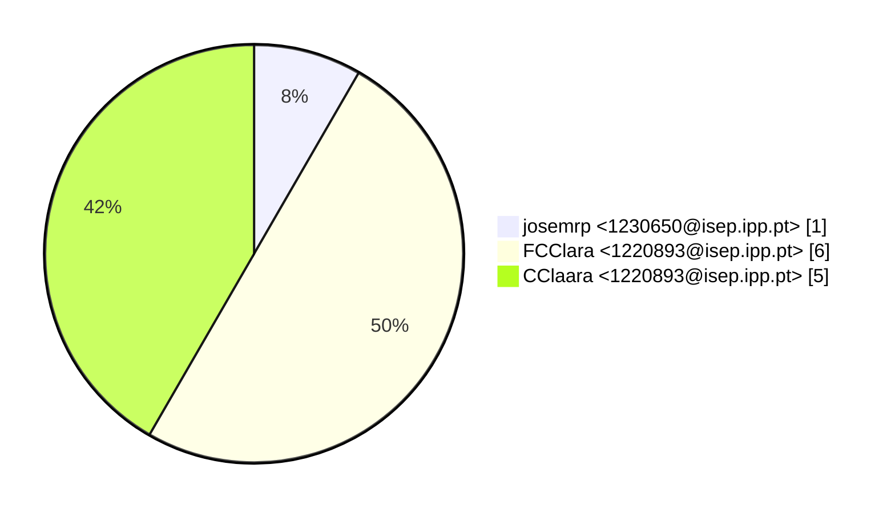

# Contribution stats by author 
|author|insertions|insertions_per|deletions|deletions_per|files|files_per|commits|commits_per|lines_changed|lines_changed_per|
|---|---|---|---|---|---|---|---|---|---|---|
| josemrp <1230650@isep.ipp.pt>|2|1%|1|2%|1|8%|1|33%|3|1%|
| FCClara <1220893@isep.ipp.pt>|145|52%|46|90%|6|50%|1|33%|191|58%|
| CClaara <1220893@isep.ipp.pt>|131|47%|4|8%|5|42%|1|33%|135|41%|

## Commits percentage

## Lines changed

## Files changed

