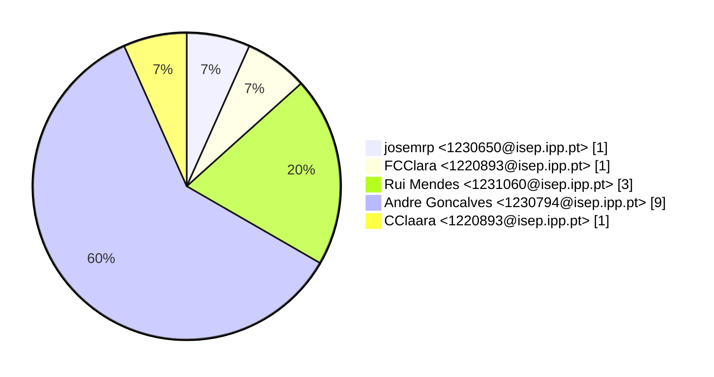
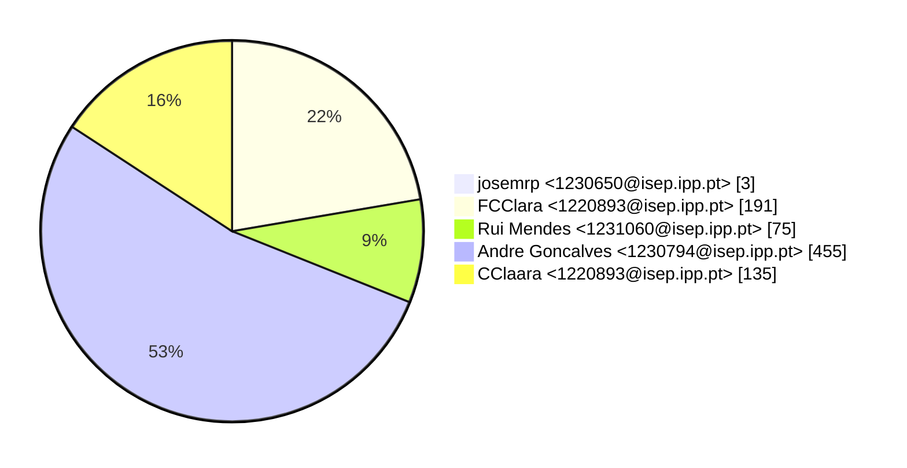
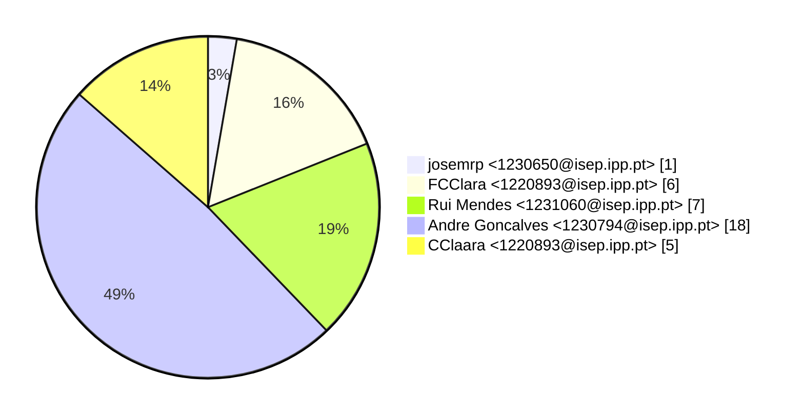

# Contribution stats by author 
|author|insertions|insertions_per|deletions|deletions_per|files|files_per|commits|commits_per|lines_changed|lines_changed_per|
|---|---|---|---|---|---|---|---|---|---|---|
| josemrp <1230650@isep.ipp.pt>|2|0%|1|1%|1|3%|1|7%|3|0%|
| FCClara <1220893@isep.ipp.pt>|145|20%|46|34%|6|16%|1|7%|191|22%|
| Rui Mendes <1231060@isep.ipp.pt>|43|6%|32|23%|7|19%|3|20%|75|9%|
| Andre Goncalves <1230794@isep.ipp.pt>|401|56%|54|39%|18|49%|9|60%|455|53%|
| CClaara <1220893@isep.ipp.pt>|131|18%|4|3%|5|14%|1|7%|135|16%|

## Commits percentage

## Lines changed

## Files changed

