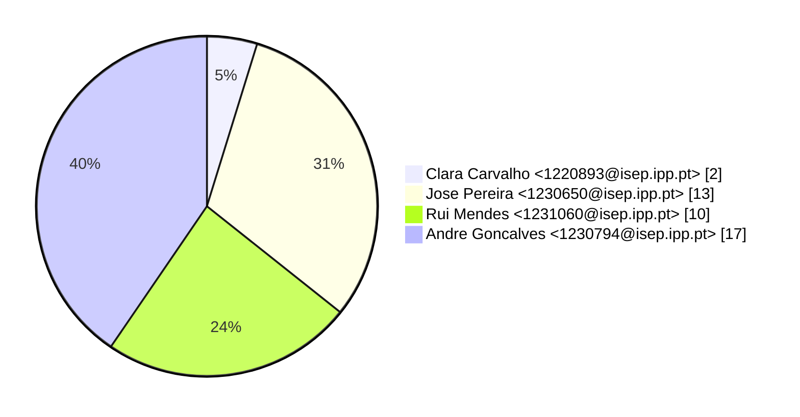
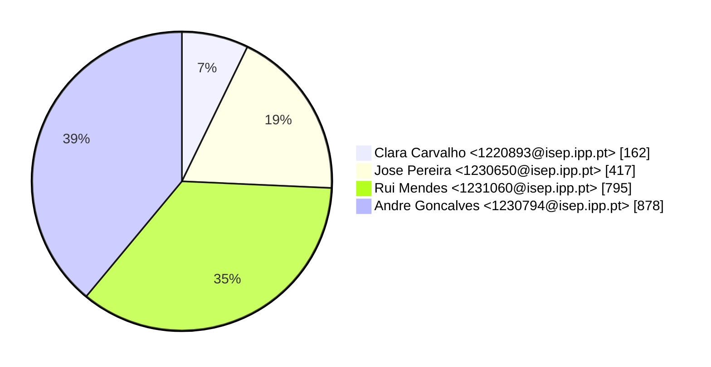
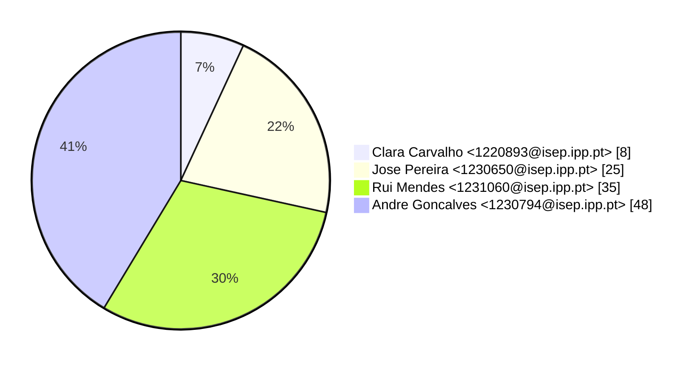

# Contribution stats by author 
|author|insertions|insertions_per|deletions|deletions_per|files|files_per|commits|commits_per|lines_changed|lines_changed_per|
|---|---|---|---|---|---|---|---|---|---|---|
| Clara Carvalho <1220893@isep.ipp.pt>|82|5%|80|11%|8|7%|2|5%|162|7%|
| Jose Pereira <1230650@isep.ipp.pt>|260|17%|157|22%|25|22%|13|31%|417|19%|
| Rui Mendes <1231060@isep.ipp.pt>|623|40%|172|25%|35|30%|10|24%|795|35%|
| Andre Goncalves <1230794@isep.ipp.pt>|586|38%|292|42%|48|41%|17|40%|878|39%|

## Commits percentage

## Lines changed

## Files changed

