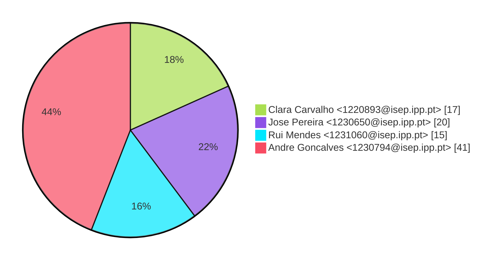
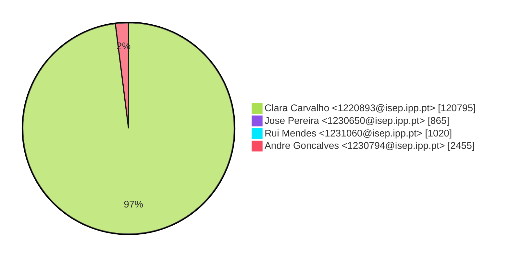
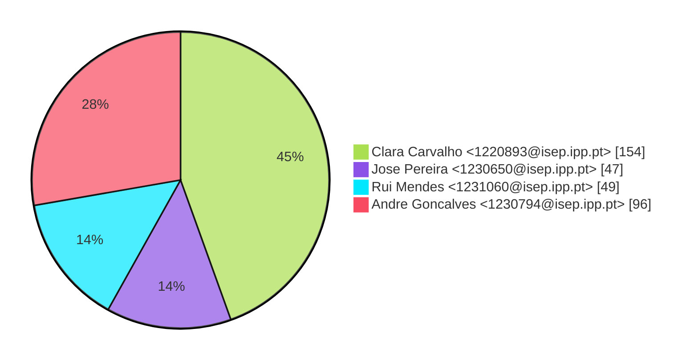

# Contribution stats by author 
|author|insertions|insertions_per|deletions|deletions_per|files|files_per|commits|commits_per|lines_changed|lines_changed_per|
|---|---|---|---|---|---|---|---|---|---|---|
| Clara Carvalho <1220893@isep.ipp.pt>|60644|95%|60151|98%|154|45%|17|18%|120795|97%|
| Jose Pereira <1230650@isep.ipp.pt>|527|1%|338|1%|47|14%|20|22%|865|1%|
| Rui Mendes <1231060@isep.ipp.pt>|820|1%|200|0%|49|14%|15|16%|1020|1%|
| Andre Goncalves <1230794@isep.ipp.pt>|1687|3%|768|1%|96|28%|41|44%|2455|2%|

## Commits percentage

## Lines changed

## Files changed

