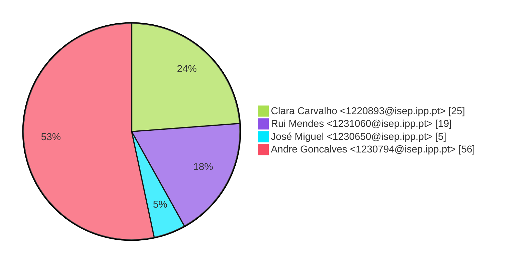
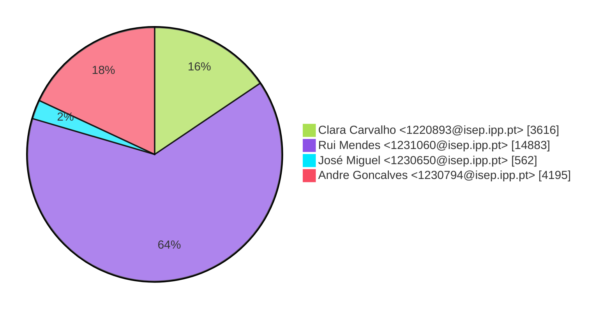
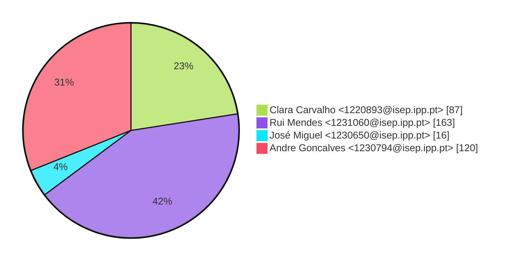

# Contribution stats by author 
|author|insertions|insertions_per|deletions|deletions_per|files|files_per|commits|commits_per|lines_changed|lines_changed_per|
|---|---|---|---|---|---|---|---|---|---|---|
| Clara Carvalho <1220893@isep.ipp.pt>|2484|12%|1132|49%|87|23%|25|24%|3616|16%|
| Rui Mendes <1231060@isep.ipp.pt>|14625|70%|258|11%|163|42%|19|18%|14883|64%|
| José Miguel <1230650@isep.ipp.pt>|399|2%|163|7%|16|4%|5|5%|562|2%|
| Andre Goncalves <1230794@isep.ipp.pt>|3459|16%|736|32%|120|31%|56|53%|4195|18%|

## Commits percentage

## Lines changed

## Files changed

